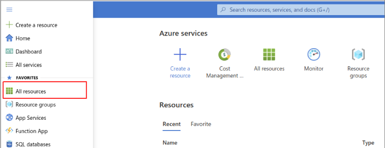
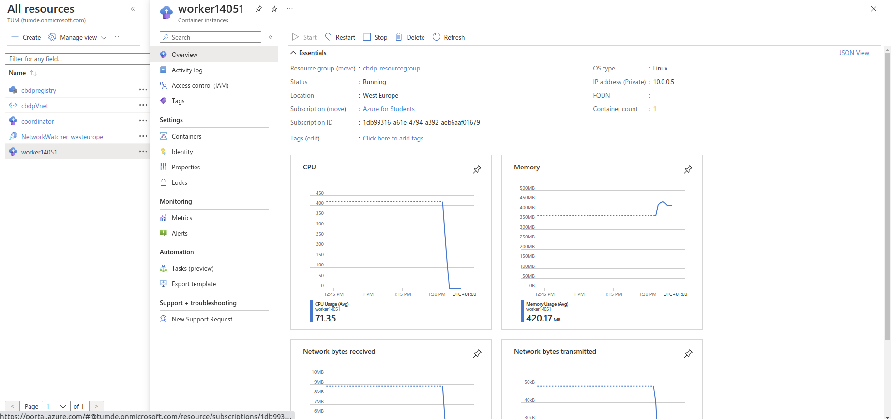
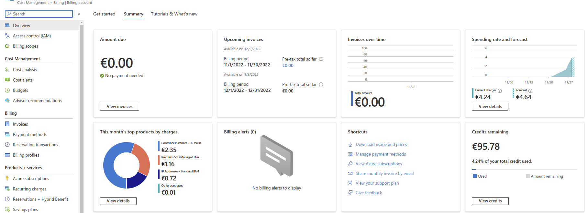

## 1. Microsoft Azure - Get Student Credits

The next step is to deploy our application in Microsoft Azure, Microsoft's cloud computing platform.

Before proceeding, make sure that you have activated your institutional Microsoft account through [TUM Online](https://campus.tum.de/). This can be done by selecting "Microsoft 365" on the bottom right of your [TUM Online](https://campus.tum.de/) personal page and then activating. Your account will be activated within 1-2 hours, you can check that it is activated by logging in [here](https://myaccount.microsoft.com/).

In order to use a commercial cloud platform for this scope, we need to obtain some cloud credits. You will have to register [here](https://azure.microsoft.com/en-us/free/students/) with your institutional email, in order to claim $100 in student credits.

In order to do this, you should choose: Start Free -> Sign-In Options -> Sign-In to an organization, and then, in the "Find your Organization" page you should put tum.de or in.tum.de, depending on the email you will use to sign up, and then proceed to register.

After registering, you will be able to view all available Azure services from the Azure portal:
https://portal.azure.com/#home

Confirm that you have received the credits by checking your Remaining Credits under [Cost Management + Billing](https://portal.azure.com/#view/Microsoft_Azure_GTM/ModernBillingMenuBlade/~/Overview)

If you see a value close to 100$, then everything went fine and we are ready to deploy our first application on Azure.

Although one Azure account per group would be ok for this assignment, we recommend that all members of the group follow this process, to familiarize yourselves with the Cloud environment. You can also use the remaining credits in future projects.

## 2. Dockerize your application

First, build a container and run it locally.

```bash
# make sure to build your executable first
cmake --build cmake-build-debug --target all
# Then build the coordinator container
docker build -t cbdp_coordinator --target coordinator .
# The worker container
docker build -t cbdp_worker --target worker .
# And a network between the containers
docker network create cbdp_net

# Then you can start your containers
docker run -d --network=cbdp_net --name=coordinator cbdp_coordinator
docker run --network=cbdp_net -d cbdp_worker

# Monitor the running containers
docker ps
# And see what they printed - the coordinator should print 275625 after some seconds 
docker logs coordinator

# Clean up for re-runs
docker rm coordinator
# Alternatively: `docker container prune`, but handle with care
```


## 3. Deploy and run on Azure

Now run your containers using [Azure CLI](https://github.com/Azure/azure-cli).

https://learn.microsoft.com/en-us/training/modules/intro-to-containers/6-deploy-docker-image-to-container-instance

```bash
# Log in to Azure. This opens a browser window to authorize
az login

# Create a "resource group" that bundles your setup
az group create --name cbdp-resourcegroup --location westeurope
# Create a container registry for your coordinator/worker containers
# You need a unique name for your registry, try choosing your group name
REGISTRY_NAME="cbdpgroup999"
az acr create --name "$REGISTRY_NAME" --resource-group cbdp-resourcegroup --sku standard --admin-enabled true
# See your login details. These are PRIVATE, don't show around, but you will need them to start containers - so copy paste them somewhere.
az acr credential show --name "$REGISTRY_NAME" --resource-group cbdp-resourcegroup
# Log into the azure docker registry. Use the credentials from the last command
docker login "$REGISTRY_NAME.azurecr.io"

# Push your local containers to the registry
docker tag cbdp_coordinator "$REGISTRY_NAME.azurecr.io"/cbdp_coordinator
docker push "$REGISTRY_NAME.azurecr.io"/cbdp_coordinator
docker tag cbdp_worker "$REGISTRY_NAME.azurecr.io"/cbdp_worker
docker push "$REGISTRY_NAME.azurecr.io"/cbdp_worker

# You should now see your images in azure:
az acr repository list --name "$REGISTRY_NAME" --resource-group cbdp-resourcegroup

# Create a network between the containers
az network vnet create -g cbdp-resourcegroup --name cbdpVnet
az network vnet subnet create -g cbdp-resourcegroup --vnet-name cbdpVnet -n cbdpSubnet --address-prefixes 10.0.0.0/24

# Start the coordinator and query its IP (it will most probably be 10.0.0.4)
az container create -g cbdp-resourcegroup --vnet cbdpVnet --subnet cbdpSubnet --restart-policy Never --name coordinator --image "$REGISTRY_NAME.azurecr.io"/cbdp_coordinator
COORDINATOR=$(az container show --resource-group cbdp-resourcegroup --name coordinator --query ipAddress.ip --output tsv)
echo $COORDINATOR

# Then you can start workers
az container create -g cbdp-resourcegroup --vnet cbdpVnet --subnet cbdpSubnet --restart-policy Never --name "worker$RANDOM" --image "$REGISTRY_NAME.azurecr.io"/cbdp_worker --environment-variables CBDP_COORDINATOR="$COORDINATOR"

# And see the coordinator log
az container logs --name coordinator -g cbdp-resourcegroup
# Clean up after running to save credits
az container delete --name coordinator -g cbdp-resourcegroup
```

## 4. Container Monitoring

Once you start your containers, you can verify that they are up and running by checking that they have appeared here [here](https://portal.azure.com/#view/HubsExtension/BrowseAll).



You can also choose a specific container and monitor resource usage (CPU and memory usage, network bytes sent/received)


Finally, always stop and delete your containers after finishing with your work, and regularly check how many of the credits you have consumed. 


